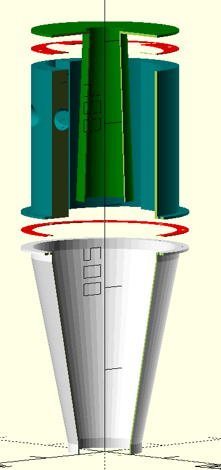
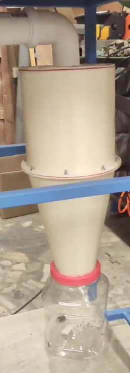

= 3d printed box with hinges
:openscad_lib_name: box_with_hinges

This library contains box with hinges generator, that is useful for creating various equipment cases, e.g. soldering irons, multimeters, etc.

[cols=2]
|===
a|
.Cyclone filter parts

a|
.Assembled

|===

This library depends on https://github.com/nophead/NopSCADlib[NopSCADlib] and can be used as a git submodule in NopSCADlib styled CAD projects:

[source,bash,subs=attributes+]
----
git submodule add https://github.com/eraga/{openscad_lib_name} lib/{openscad_lib_name}
----

== Example usage

[source,openscad,subs=attributes+]
----
include <../lib/{openscad_lib_name}/boxes_with_hinges.scad>

box_with_hinges_assembly(SAMPLE_BOX);

// draw your own box
module box_with_hinges_bottom_sample_stl() {
    difference(){
        box_with_hinges_bottom(SAMPLE_BOX);
        // place a pocket
        cube([5,10,20]);
    }
}
----
