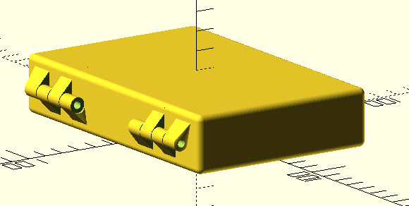

= 3d printed box with hinges
:openscad_lib_name: box_with_hinges

This library contains box with hinges generator, that is useful for creating various equipment cases, e.g. soldering irons, multimeters, etc.

This library depends on https://github.com/nophead/NopSCADlib[NopSCADlib] and can be used as a git submodule in NopSCADlib styled CAD projects:

[source,bash,subs=attributes+]
----
git submodule add https://github.com/eraga/{openscad_lib_name} lib/{openscad_lib_name}
----

== Example usage

See xref:box_et8134_multimeter.scad[].

[source,openscad,subs=attributes+]
----
include::box_et8134_multimeter.scad[]
----
